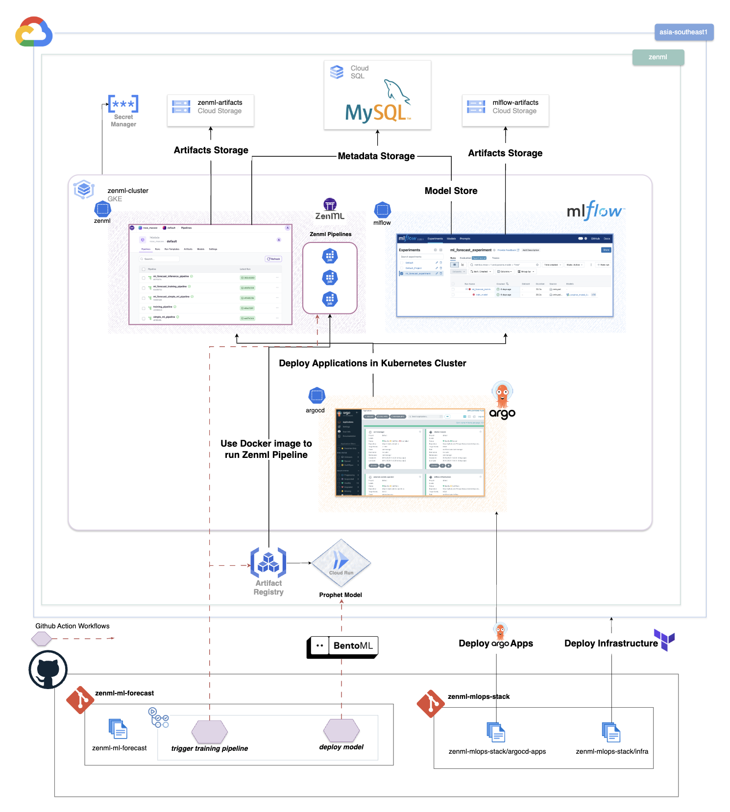

# ZenML ML Forecast

A machine learning forecasting project that demonstrates ZenML capabilities using Facebook Prophet for time series prediction. This project showcases end-to-end ML pipeline orchestration, model deployment with BentoML, and deployment to Google Cloud Run.

You can find the Github repository of the deployed MlOps platform [here]([here](https://github.com/Philippe-Neveux/zenml-mlops-stack)). Here is the architecture overview of this MlOps Platform



## Overview

This project implements a retail sales forecasting system that:
- Uses Facebook Prophet for time series forecasting
- Leverages ZenML for ML pipeline orchestration
- Deploys models using BentoML
- Supports multiple store-item segments for prediction
- Provides automated CI/CD deployment to Google Cloud Run

The example and code are based on this [repository](https://github.com/zenml-io/zenml-projects/tree/main/retail-forecast). The purpose of this repository is to showcase ZenML capabilities rather than providing production-ready Python code.

## Project Structure

```
zenml-ml-forecast/
├── README.md                    # This file
├── pyproject.toml              # Project configuration and dependencies
├── main.py                     # Entry point
├── service.py                  # BentoML service definition
├── Makefile                    # Build and development commands
├── data/                       # Training data
│   ├── calendar.csv
│   └── sales.csv
├── notebooks/                  # Jupyter notebooks for exploration
│   └── debug.ipynb
├── artifacts/                  # Model artifacts
│   └── models/
└── zenml_ml_forecast/          # Main package
    ├── __init__.py
    ├── main.py                 # ZenML pipeline definition
    ├── training.py             # Training pipeline
    ├── inference.py            # Inference pipeline
    ├── steps.py                # Legacy pipeline steps
    ├── configs/                # Pipeline configurations
    │   ├── inference.yaml
    │   └── training.yaml
    ├── steps/                  # Pipeline step definitions
    │   ├── __init__.py
    │   ├── data_processing.py
    │   ├── model.py
    │   └── predictor.py
    └── materializers/          # Custom ZenML materializers
        ├── __init__.py
        └── prophet_materializer.py
```

## Features

- **Multi-segment forecasting**: Supports 15 different store-item combinations
- **Prophet integration**: Uses Facebook Prophet for robust time series forecasting
- **ZenML orchestration**: Demonstrates pipeline orchestration with Kubernetes support
- **BentoML deployment**: Ready-to-deploy ML service with REST API
- **Cloud deployment**: Automated deployment to Google Cloud Run
- **MLflow integration**: Model versioning and experiment tracking

## Supported Segments

The model supports forecasting for the following store-item combinations:
- Store_1: Item_A, Item_B, Item_C, Item_D, Item_E
- Store_2: Item_A, Item_B, Item_C, Item_D, Item_E  
- Store_3: Item_A, Item_B, Item_C, Item_D, Item_E

## Quick Start

### Prerequisites

- Python 3.10+
- UV package manager (recommended) or pip
- MLflow tracking server (default: https://mlflow.34.40.165.212.nip.io)

### Installation

```bash
# Clone the repository
git clone <repository-url>
cd zenml-ml-forecast

# Install dependencies using UV
uv sync

# Or using pip
pip install -e .
```

### Running the Project

```bash
# Train models
uv run training

# Run inference
uv run inference

# Start BentoML service locally
bentoml serve service:ProphetModel
```

## API Usage

The BentoML service provides two endpoints:

### Prediction Endpoint
```bash
POST /predict
{
    "segment": "Store_1-Item_A",
    "period": 365
}
```

### Health Check
```bash
GET /health
```

Example using curl:
```bash
# Make a prediction
curl -X POST "http://localhost:3000/predict" \
     -H "Content-Type: application/json" \
     -d '{"segment": "Store_1-Item_A", "period": 30}'

# Health check
curl "http://localhost:3000/health"
```

## Development

### Dependencies

Key dependencies include:
- **ZenML**: ML pipeline orchestration
- **Prophet**: Time series forecasting
- **BentoML**: Model serving framework
- **MLflow**: Experiment tracking and model registry
- **Kubernetes**: Container orchestration support
- **Pandas**: Data manipulation
- **Plotly**: Data visualization

### Development Setup

```bash
# Install development dependencies
uv sync --group dev

# Run tests
pytest

# Code formatting and linting
ruff check
ruff format
```

## Deployment

### Local Deployment

```bash
# Build BentoML service
bentoml build

# Serve locally
bentoml serve service:ProphetModel
```

### Google Cloud Run Deployment

This project includes automated deployment to Google Cloud Run via GitHub Actions. See the deployment configuration section below for setup instructions.

## GitHub Actions CD Workflow Configuration

### Required GitHub Secrets

Configure the following secrets in your GitHub repository (Settings > Secrets and variables > Actions):

#### 1. `GCP_PROJECT_ID` (Required)
- **Description**: Your Google Cloud Project ID
- **Example**: `my-gcp-project-123456`

#### 2. `GCP_SA_KEY` (Required)
- **Description**: JSON key for a Google Cloud Service Account
- **Required permissions**:
  - Artifact Registry Administrator
  - Cloud Run Admin
  - Service Account User
  - Storage Admin (if using GCS for model storage)

#### Creating the Service Account:
```bash
# Create service account
gcloud iam service-accounts create bentoml-deployer \
    --description="Service account for BentoML deployment" \
    --display-name="BentoML Deployer"

# Grant necessary roles
gcloud projects add-iam-policy-binding YOUR_PROJECT_ID \
    --member="serviceAccount:bentoml-deployer@YOUR_PROJECT_ID.iam.gserviceaccount.com" \
    --role="roles/artifactregistry.writer"

gcloud projects add-iam-policy-binding YOUR_PROJECT_ID \
    --member="serviceAccount:bentoml-deployer@YOUR_PROJECT_ID.iam.gserviceaccount.com" \
    --role="roles/run.developer"

gcloud projects add-iam-policy-binding YOUR_PROJECT_ID \
    --member="serviceAccount:bentoml-deployer@YOUR_PROJECT_ID.iam.gserviceaccount.com" \
    --role="roles/iam.serviceAccountUser"

# Create and download key
gcloud iam service-accounts keys create key.json \
    --iam-account=bentoml-deployer@YOUR_PROJECT_ID.iam.gserviceaccount.com
```

#### 3. `MLFLOW_TRACKING_URI` (Optional)
- **Description**: MLflow tracking server URI
- **Default**: `https://mlflow.34.40.165.212.nip.io`

### Optional GitHub Variables

Configure in Settings > Secrets and variables > Actions > Variables:

- `GAR_LOCATION`: Google Artifact Registry location (default: `us-central1`)
- `GAR_REPOSITORY`: Artifact Registry repository name (default: `zenml-ml-forecast`)
- `CLOUD_RUN_SERVICE`: Cloud Run service name (default: `prophet-forecasting-service`)
- `CLOUD_RUN_REGION`: Cloud Run deployment region (default: `us-central1`)

### Workflow Triggers

The deployment workflow is triggered by:
1. **Push to main branch** with changes to:
   - `zenml_ml_forecast/**`
   - `bentofile.yaml`
   - `pyproject.toml`
2. **Manual trigger** via GitHub Actions UI

### Deployment Configuration

The Cloud Run service is deployed with:
- **Memory**: 2Gi
- **CPU**: 2 cores
- **Port**: 3000
- **Timeout**: 300 seconds
- **Concurrency**: 1000 requests
- **Scaling**: 0-10 instances
- **Authentication**: Allow unauthenticated requests

### Pre-deployment Setup

Before running the workflow:

1. Enable required GCP APIs:
```bash
gcloud services enable artifactregistry.googleapis.com
gcloud services enable run.googleapis.com
gcloud services enable cloudbuild.googleapis.com
```

2. Set up GitHub repository secrets as described above
3. Ensure MLflow models are accessible from the tracking URI
4. Trigger the workflow by pushing to main or using manual dispatch

### Troubleshooting Deployment

- **Authentication errors**: Verify service account key and permissions
- **Build failures**: Check dependencies in `bentofile.yaml`
- **Deployment failures**: Verify Cloud Run quotas and region availability
- **Model loading errors**: Ensure MLflow tracking URI is accessible and models exist

## Architecture

### ZenML Pipeline

The project uses ZenML for pipeline orchestration with Kubernetes support:
- Docker containerization for reproducible environments
- Kubernetes orchestrator with resource management
- Custom materializers for Prophet models
- Integration with MLflow for experiment tracking

### BentoML Service

The ML service is built with BentoML and includes:
- Automatic model loading from MLflow registry
- REST API for predictions and health checks
- Type-safe segment validation
- Configurable forecasting periods

## Contributing

1. Fork the repository
2. Create a feature branch
3. Make your changes
4. Run tests and linting
5. Submit a pull request

## Support

For questions about ZenML, visit the [ZenML documentation](https://docs.zenml.io/) or join the [ZenML Slack community](https://zenml.io/slack-invite/).